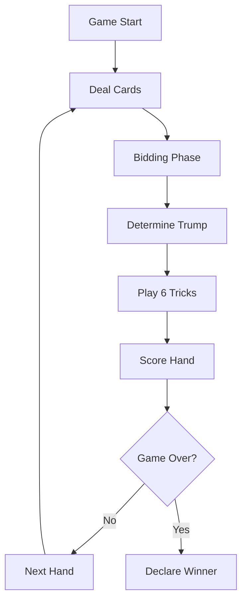

# Setback Card Game - Technical Architecture Document

- [Setback Card Game - Technical Architecture Document](#setback-card-game---technical-architecture-document)
  - [📋 **Document Information**](#-document-information)
  - [🎯 **Executive Summary**](#-executive-summary)
  - [🏗️ **System Architecture Overview**](#️-system-architecture-overview)
    - [**High-Level Architecture Pattern**](#high-level-architecture-pattern)
  - [🗂️ **Project Structure Architecture**](#️-project-structure-architecture)
    - [**Directory Organization**](#directory-organization)
  - [🧱 **Core Component Architecture**](#-core-component-architecture)
    - [**1. Entity Layer Components**](#1-entity-layer-components)
      - [**🃏 Card Entity**](#-card-entity)
      - [**🎴 Deck Entity**](#-deck-entity)
      - [**👤 Player Entity**](#-player-entity)
    - [**2. Manager Layer Components**](#2-manager-layer-components)
      - [**🎮 GameManager (Core Controller)**](#-gamemanager-core-controller)
      - [**🧮 ScoreManager**](#-scoremanager)
      - [**🤖 AIManager**](#-aimanager)
    - [**3. Presentation Layer (Phaser 3 Scenes)**](#3-presentation-layer-phaser-3-scenes)
      - [**🚀 BootScene**](#-bootscene)
      - [**📋 MenuScene**](#-menuscene)
      - [**🎲 GameScene (Primary Interface)**](#-gamescene-primary-interface)
  - [🔄 **Game Flow Architecture**](#-game-flow-architecture)
    - [**Complete Game Cycle**](#complete-game-cycle)
    - [**State Machine Architecture**](#state-machine-architecture)
    - [**Event Flow Patterns**](#event-flow-patterns)
  - [🛠️ **Technology Stack Architecture**](#️-technology-stack-architecture)
    - [**Frontend Framework**](#frontend-framework)
    - [**Development Tools**](#development-tools)
    - [**Build Architecture**](#build-architecture)
    - [**Type System Architecture**](#type-system-architecture)
  - [🔧 **Integration Patterns**](#-integration-patterns)
    - [**Phaser ↔ Game Logic Integration**](#phaser--game-logic-integration)
    - [**Event-Driven Communication**](#event-driven-communication)
  - [📊 **Performance Architecture**](#-performance-architecture)
    - [**Optimization Strategies**](#optimization-strategies)
    - [**Scalability Considerations**](#scalability-considerations)
  - [🔮 **Future Architecture Extensions**](#-future-architecture-extensions)
    - [**Multiplayer Architecture (Planned)**](#multiplayer-architecture-planned)
    - [**AI Enhancement Architecture**](#ai-enhancement-architecture)
    - [**Game Engine Extension**](#game-engine-extension)
  - [🧪 **Testing Architecture**](#-testing-architecture)
    - [**Testing Strategy Layers**](#testing-strategy-layers)
    - [**Test Coverage Targets**](#test-coverage-targets)
  - [📝 **Development Workflow Architecture**](#-development-workflow-architecture)
    - [**Git Workflow**](#git-workflow)
    - [**Code Quality Gates**](#code-quality-gates)
  - [📋 **Architecture Decision Records (ADRs)**](#-architecture-decision-records-adrs)
    - [**ADR-001: Event-Driven Architecture**](#adr-001-event-driven-architecture)
    - [**ADR-002: TypeScript over JavaScript**](#adr-002-typescript-over-javascript)
    - [**ADR-003: Phaser 3 for Game Engine**](#adr-003-phaser-3-for-game-engine)
    - [**ADR-004: Vite over Webpack**](#adr-004-vite-over-webpack)
  - [🔗 **References \& Dependencies**](#-references--dependencies)
    - [**External References**](#external-references)
    - [**Key Dependencies**](#key-dependencies)

## 📋 **Document Information**

- **Document Type:** Technical Architecture Specification
- **Version:** 1.0
- **Last Updated:** January 2025
- **Status:** Living Document
- **Audience:** Development Team, Technical Stakeholders

---

## 🎯 **Executive Summary**

This document defines the comprehensive technical architecture for the **Setback Card Game**, a web-based implementation of the traditional 4-player partnership card game. The system is built using modern web technologies with a focus on extensibility, maintainability, and performance.

**Key Architecture Principles:**

- **Event-Driven Design**: Loose coupling through EventEmitter pattern
- **Type-Safe Development**: Comprehensive TypeScript interfaces
- **Component Separation**: Clear boundaries between entities, managers, and presentation
- **Scalable Foundation**: Architecture supports future multiplayer and AI enhancements

---

## 🏗️ **System Architecture Overview**

### **High-Level Architecture Pattern**

```text
┌─────────────────────────────────────────────────────────────┐
│                    PRESENTATION LAYER                       │
│  ┌─────────────┐  ┌─────────────┐  ┌─────────────┐        │
│  │  BootScene  │  │ MenuScene   │  │  GameScene  │        │
│  └─────────────┘  └─────────────┘  └─────────────┘        │
└─────────────────────────────────────────────────────────────┘
                              │
                              ▼
┌─────────────────────────────────────────────────────────────┐
│                    BUSINESS LOGIC LAYER                     │
│  ┌─────────────────┐                                       │
│  │   GameManager   │ ──── Events ────▶ UI Updates         │
│  │ (EventEmitter)  │                                       │
│  └─────────────────┘                                       │
└─────────────────────────────────────────────────────────────┘
                              │
                              ▼
┌─────────────────────────────────────────────────────────────┐
│                     ENTITY LAYER                           │
│  ┌───────────┐  ┌───────────┐  ┌───────────┐  ┌─────────┐ │
│  │   Card    │  │   Deck    │  │  Player   │  │  Trick  │ │
│  └───────────┘  └───────────┘  └───────────┘  └─────────┘ │
└─────────────────────────────────────────────────────────────┘
                              │
                              ▼
┌─────────────────────────────────────────────────────────────┐
│                      TYPE SYSTEM                           │
│  ┌─────────────────┐  ┌─────────────────┐                 │
│  │  Game Types     │  │  Global Types   │                 │
│  │  Interfaces     │  │  Declarations   │                 │
│  └─────────────────┘  └─────────────────┘                 │
└─────────────────────────────────────────────────────────────┘
```

---

## 🗂️ **Project Structure Architecture**

### **Directory Organization**

```text
setback-card-game/
├── 📁 src/                          # Source code root
│   ├── 📁 game/                     # Phaser 3 core configuration
│   │   └── GameConfig.ts            # Main Phaser game configuration
│   ├── 📁 scenes/                   # Phaser 3 scene implementations
│   │   ├── BootScene.ts             # Asset loading & initialization
│   │   ├── MenuScene.ts             # Main menu & game setup
│   │   └── GameScene.ts             # Primary gameplay interface
│   ├── 📁 entities/                 # Core game objects
│   │   ├── Card.ts                  # Card entity with Setback rules
│   │   ├── Deck.ts                  # 53-card deck management
│   │   ├── Player.ts                # Player state & behavior
│   │   └── Trick.ts                 # Individual trick management
│   ├── 📁 managers/                 # Business logic controllers
│   │   ├── GameManager.ts           # Central game state management
│   │   ├── ScoreManager.ts          # Scoring calculations
│   │   ├── AIManager.ts             # AI player decision logic
│   │   └── NetworkManager.ts        # Future: multiplayer support
│   ├── 📁 utils/                    # Utility functions
│   │   ├── CardUtils.ts             # Card manipulation helpers
│   │   ├── ValidationUtils.ts       # Input validation
│   │   └── EventUtils.ts            # Event handling utilities
│   ├── 📁 types/                    # TypeScript definitions
│   │   ├── game.ts                  # Game-specific interfaces
│   │   ├── global.d.ts              # Global type declarations
│   │   └── events.ts                # Event type definitions
│   ├── 📁 assets/                   # Static asset organization
│   │   ├── 📁 images/               # Sprites, textures, UI graphics
│   │   ├── 📁 audio/                # Sound effects, music
│   │   └── 📁 fonts/                # Custom typography
│   └── main.ts                      # Application entry point
├── 📁 docs/                         # Project documentation
│   ├── project-brief.md             # Project overview & requirements
│   ├── setback-project.md           # Original requirements document
│   ├── references.md                # External references & resources
│   └── architecture.md              # This document
└── 📁 public/                       # Static public assets
```

---

## 🧱 **Core Component Architecture**

### **1. Entity Layer Components**

#### **🃏 Card Entity**

```typescript
interface ICard {
  suit: Suit | null;     // null for joker
  rank: Rank;            // 2-15 (joker = 15)
  id: string;            // unique identifier
  isJoker: boolean;      // joker flag
}

class Card implements ICard {
  // Core properties + rich behavior methods:
  - displayName: string          // "Ace of Hearts"
  - shortName: string           // "AH"
  - pointValue: number          // Small points value
  - isTrump(trumpSuit): boolean
  - isOffJack(trumpSuit): boolean
  - compareForTrump(other, trumpSuit): number
  - canFollow(leadSuit, hand, trumpSuit): boolean
}
```

**Responsibilities:**

- Setback-specific card behavior
- Trump/off-jack logic implementation
- Point value calculations
- Card comparison for trick-taking

#### **🎴 Deck Entity**

```typescript
class Deck {
  private cards: Card[];

  // Core deck operations:
  - initializeDeck(): void      // Create 53-card deck
  - shuffle(): void             // Fisher-Yates shuffle
  - dealCard(): Card | null     // Deal single card
  - dealCards(count): Card[]    // Deal multiple cards
  - reset(): void               // Reshuffle full deck
}
```

**Responsibilities:**

- 53-card deck management (52 + joker)
- Shuffling and dealing operations
- Deck state tracking

#### **👤 Player Entity**

```typescript
interface Player {
  id: string;
  name: string;
  hand: Card[];
  position: PlayerPosition;     // North/South/East/West
  partnerId: string;
  isHuman: boolean;
  isDealer: boolean;
}
```

**Responsibilities:**

- Individual player state
- Hand management
- Position and partnership tracking

### **2. Manager Layer Components**

#### **🎮 GameManager (Core Controller)**

```typescript
class GameManager extends EventEmitter {
  private gameState: GameState;
  private deck: Deck;
  private config: GameConfig;

  // Primary game flow methods:
  - startGame(): void
  - dealHand(): void
  - startBidding(): void
  - placeBid(playerId, amount): boolean
  - playCard(playerId, card): boolean
  - scoreHand(): void
}
```

**Event Architecture:**

```typescript
// GameManager emits these events:
'gameStarted'    → Initial game setup complete
'biddingStarted' → Bidding phase begins
'bidPlaced'      → Individual bid processed
'biddingEnded'   → Trump suit determined
'playStarted'    → Card playing phase begins
'cardPlayed'     → Individual card played
'trickCompleted' → Trick winner determined
'handScored'     → Points calculated and awarded
'gameEnded'      → Final winner determined
```

**Responsibilities:**

- Central game state management
- Game phase transitions
- Rule enforcement
- Event coordination

#### **🧮 ScoreManager**

```typescript
class ScoreManager {
  // Setback scoring implementation:
  - calculateHighLow(tricks, trumpSuit): {high: string, low: string}
  - calculateGamePoints(tricks): {partnership: string, points: number}
  - calculateJackPoints(tricks, trumpSuit): ScoreBreakdown
  - updatePartnershipScores(handResults): void
  - checkWinCondition(): Partnership | null
}
```

**Scoring Categories:**

1. **High Trump** - Highest trump card taken
2. **Low Trump** - Lowest trump card taken
3. **Jack of Trump** - If dealt and captured
4. **Off Jack** - Same-color jack captured
5. **Joker** - If dealt and captured
6. **Game Points** - Most "small points" (J=1, Q=2, K=3, A=4, 10=10)

#### **🤖 AIManager**

```typescript
class AIManager {
  // AI decision-making:
  - evaluateHandStrength(hand, trumpSuit): number
  - decideBid(hand, currentBid, position): number | null
  - selectCardToPlay(hand, trick, gameState): Card
  - calculateCardValue(card, gameContext): number
}
```

**AI Strategies:**

- **Bidding Logic**: Hand evaluation based on trump potential
- **Card Selection**: Follow suit, trump strategy, point protection
- **Partnership Coordination**: Future enhancement for advanced AI

### **3. Presentation Layer (Phaser 3 Scenes)**

#### **🚀 BootScene**

```typescript
class BootScene extends Scene {
  preload(): void {
    - createLoadingBar()
    - loadEssentialAssets()
    - createCardTextures()
  }
  create(): void {
    - transitionToMenu()
  }
}
```

**Responsibilities:**

- Asset loading with progress indication
- Texture generation for cards and UI
- Initial game setup

#### **📋 MenuScene**

```typescript
class MenuScene extends Scene {
  create(): void {
    - renderMainMenu()
    - setupGameConfiguration()
    - showInstructions()
  }
}
```

**Responsibilities:**

- Game mode selection
- Player configuration
- Rules explanation
- Settings management

#### **🎲 GameScene (Primary Interface)**

```typescript
class GameScene extends Scene {
  private gameManager: GameManager;
  private playerTexts: {[id: string]: Text};
  private scoreTexts: {[id: string]: Text};

  create(): void {
    - setupGameEvents()
    - createPlayerAreas()
    - createScoreDisplay()
    - createHandArea()
    - createInteractionUI()
  }
}
```

**UI Architecture:**

```text
      ┌─── North Player ───┐
      │                   │
West  │    Card Table     │  East
Player│      Center       │ Player
      │                   │
      └─── South Player ───┘
           (Human)
```

**Event Handling:**

- GameManager events → UI updates
- User input → GameManager method calls
- State changes → Visual feedback

---

## 🔄 **Game Flow Architecture**

### **Complete Game Cycle**



### **State Machine Architecture**

```typescript
enum GamePhase {
  SETUP = 'setup',
  DEALING = 'dealing',
  BIDDING = 'bidding',
  PLAYING = 'playing',
  SCORING = 'scoring',
  GAME_OVER = 'game_over'
}

interface GameState {
  players: Player[];
  partnerships: Partnership[];
  currentHand: {
    trumpSuit: Suit | null;
    currentBid: Bid | null;
    biddingPhase: boolean;
    currentPlayerIndex: number;
    tricks: Trick[];
    currentTrick: Trick | null;
  };
  gamePhase: GamePhase;
  winner: Partnership | null;
}
```

### **Event Flow Patterns**

```typescript
// Typical interaction pattern:
UI Input → GameManager Method → State Change → Event Emission → UI Update

// Example: Player bids
BidButton.click()
  → gameManager.placeBid(playerId, amount)
  → Update gameState.currentBid
  → emit('bidPlaced', bid, gameState)
  → GameScene.onBidPlaced()
  → Update UI display
```

---

## 🛠️ **Technology Stack Architecture**

### **Frontend Framework**

- **Phaser 3.90.0**: Game engine with Canvas/WebGL rendering
- **TypeScript 5.x**: Type-safe development with modern ES features
- **Vite 7.x**: Fast build tool with hot module replacement

### **Development Tools**

- **ESLint**: Code quality enforcement
- **Prettier**: Code formatting consistency
- **Jest**: Unit testing framework (future)
- **Node.js 18+**: Development environment

### **Build Architecture**

```typescript
// vite.config.ts
export default defineConfig({
  resolve: {
    alias: { '@': resolve(__dirname, './src') }
  },
  build: {
    outDir: 'dist',
    sourcemap: true,
    rollupOptions: { /* optimization */ }
  },
  define: {
    __DEV__: JSON.stringify(process.env.NODE_ENV !== 'production')
  }
});
```

### **Type System Architecture**

```typescript
// Comprehensive type coverage:
- Game entities (Card, Player, Trick)
- Game state interfaces
- Event type definitions
- Phaser 3 integration types
- Global declarations (__DEV__)
```

---

## 🔧 **Integration Patterns**

### **Phaser ↔ Game Logic Integration**

```typescript
// GameScene acts as presentation layer adapter:
class GameScene extends Scene {
  private gameManager: GameManager;

  // Convert Phaser events to game actions:
  onCardClick(cardSprite: Image) {
    const card = this.getCardFromSprite(cardSprite);
    this.gameManager.playCard(this.humanPlayerId, card);
  }

  // Convert game events to visual updates:
  private setupGameEvents() {
    this.gameManager.on('cardPlayed', this.onCardPlayed.bind(this));
    this.gameManager.on('trickCompleted', this.onTrickCompleted.bind(this));
  }
}
```

### **Event-Driven Communication**

```typescript
// Loose coupling through events:
GameManager (EventEmitter)
    ↓ events
GameScene (Event Listener)
    ↓ method calls
GameManager (State Updates)
    ↓ events
UI Components (Visual Updates)
```

---

## 📊 **Performance Architecture**

### **Optimization Strategies**

- **Object Pooling**: Card sprites, text objects
- **Event Batching**: Multiple state changes in single frame
- **Lazy Loading**: Assets loaded on-demand
- **Memory Management**: Proper cleanup of Phaser objects

### **Scalability Considerations**

- **Modular Design**: Easy to add new card games
- **Plugin Architecture**: Future AI/networking extensions
- **State Persistence**: Save/load game functionality
- **Asset Optimization**: Texture atlases, compressed audio

---

## 🔮 **Future Architecture Extensions**

### **Multiplayer Architecture (Planned)**

```typescript
interface NetworkManager {
  // Real-time multiplayer support:
  - connectToGame(gameId): Promise<Connection>
  - sendPlayerAction(action): void
  - onRemoteAction(callback): void
  - handleNetworkSync(): void
}
```

### **AI Enhancement Architecture**

```typescript
interface AIStrategy {
  // Pluggable AI behaviors:
  - evaluateGameState(state): number
  - selectOptimalAction(options): Action
  - learnFromOutcome(result): void
}
```

### **Game Engine Extension**

```typescript
interface GameEngine {
  // Support multiple card games:
  - registerGameRules(rules): void
  - createGameInstance(type): Game
  - validateGameState(state): boolean
}
```

---

## 🧪 **Testing Architecture**

### **Testing Strategy Layers**

```text
┌─────────────────────────────────────────┐
│         E2E Testing                     │
│    (Full game flow validation)         │
└─────────────────────────────────────────┘
┌─────────────────────────────────────────┐
│       Integration Testing               │
│  (GameManager ↔ Scene interaction)     │
└─────────────────────────────────────────┘
┌─────────────────────────────────────────┐
│         Unit Testing                    │
│   (Entity logic, utility functions)    │
└─────────────────────────────────────────┘
```

### **Test Coverage Targets**

- **Entity Layer**: 90%+ coverage for Card, Deck logic
- **Manager Layer**: 85%+ coverage for GameManager methods
- **Integration**: Key game flow scenarios
- **Performance**: Frame rate, memory usage benchmarks

---

## 📝 **Development Workflow Architecture**

### **Git Workflow**

```text
main branch (production-ready)
    ↑
develop branch (integration)
    ↑
feature branches (individual stories)
    ↑
developer workflows
```

### **Code Quality Gates**

1. **TypeScript Compilation**: Zero errors required
2. **ESLint Validation**: Code quality standards
3. **Unit Test Coverage**: Minimum thresholds
4. **Build Verification**: Production build success

---

## 📋 **Architecture Decision Records (ADRs)**

### **ADR-001: Event-Driven Architecture**

- **Decision**: Use EventEmitter pattern for GameManager
- **Rationale**: Loose coupling, extensibility, testability
- **Alternatives**: Direct method calls, observer pattern
- **Status**: Accepted ✅

### **ADR-002: TypeScript over JavaScript**

- **Decision**: Full TypeScript implementation
- **Rationale**: Type safety, IDE support, maintenance
- **Alternatives**: JavaScript with JSDoc
- **Status**: Accepted ✅

### **ADR-003: Phaser 3 for Game Engine**

- **Decision**: Phaser 3 over custom canvas/WebGL
- **Rationale**: Rich feature set, community, documentation
- **Alternatives**: Three.js, Custom WebGL, HTML5 Canvas
- **Status**: Accepted ✅

### **ADR-004: Vite over Webpack**

- **Decision**: Vite for build tooling
- **Rationale**: Fast dev server, modern ESM support
- **Alternatives**: Webpack, Parcel, Rollup
- **Status**: Accepted ✅

---

## 🔗 **References & Dependencies**

### **External References**

- [Interview description with initial project description](./setback-project.md)
- [Pagat.com - Setback Rules](https://www.pagat.com/allfours/pitch.html)
- [Phaser 3 Documentation](https://phaser.io/phaser3)
- [TypeScript Handbook](https://www.typescriptlang.org/docs/)
- [Vite Configuration Guide](https://vitejs.dev/config/)

### **Key Dependencies**

```json
{
  "dependencies": {
    "phaser": "^3.90.0",
    "events": "^3.3.0"
  },
  "devDependencies": {
    "typescript": "^5.8.3",
    "vite": "^7.0.5",
    "@types/node": "^24.1.0"
  }
}
```

---

**Document Status:** ✅ **Complete**
**Maintainer:** Development Team
**Approval:** Architecture Review Board
