# Setback Card Game - Overall Architecture

This document provides a comprehensive overview of the Setback card game architecture, showing all major components, their relationships, and data flow patterns.

## High-Level Architecture Overview

```mermaid
graph TB
    subgraph "External Dependencies"
        Phaser["Phaser 3.90.0<br/>Game Engine"]
        Events["Events 3.3.0<br/>Event Emitter"]
        Vite["Vite<br/>Build Tool"]
        Vitest["Vitest<br/>Test Framework"]
        Biome["Biome<br/>Linter & Formatter"]
        TS["TypeScript 5.8.3<br/>Type System"]
    end

    subgraph "Presentation Layer"
        subgraph "Phaser Scenes"
            BootScene["BootScene<br/>Asset Loading"]
            MenuScene["MenuScene<br/>Game Setup"]
            GameScene["GameScene<br/>Main Gameplay"]
        end

        subgraph "UI Components"
            CardSprite["CardSprite<br/>Interactive Cards"]
            UIElements["UI Elements<br/>Buttons, Text, HUD"]
        end

        subgraph "Asset Management"
            ThemeManager["CardThemeManager<br/>5 Built-in Themes"]
            Assets["Game Assets<br/>Card Images, Sounds"]
        end
    end

    subgraph "Game Logic Layer"
        subgraph "Core Manager"
            GameManager["GameManager<br/>• Game State Management<br/>• Event Broadcasting<br/>• Rule Enforcement<br/>• AI Player Logic"]
        end

        subgraph "Game Entities"
            Card["Card Entity<br/>• Trump Logic<br/>• Point Values<br/>• Suit Following<br/>• Comparison Methods"]
            Deck["Deck Entity<br/>• 53-Card Setup<br/>• Shuffling Logic<br/>• Dealing Management"]
            Player["Player Data<br/>• Hand Management<br/>• Human/AI Flag<br/>• Partnership Info"]
        end

        subgraph "Game Systems"
            Bidding["Bidding System<br/>• 2-6 Point Range<br/>• Pass/Bid Logic<br/>• Dealer Stuck Rule"]
            TrickTaking["Trick-Taking System<br/>• Trump Hierarchy<br/>• Suit Following<br/>• Winner Determination"]
            Scoring["Scoring System<br/>• 6 Point Categories<br/>• Small Points<br/>• Bid Success/Failure"]
        end
    end

    subgraph "Type System & Configuration"
        subgraph "TypeScript Interfaces"
            GameTypes["Game Types<br/>• GameState<br/>• Player, Card, Trick<br/>• HandScoreResult"]
            Enums["Enums<br/>• Suit, Rank<br/>• GamePhase<br/>• PlayerPosition"]
        end

        subgraph "Configuration"
            GameConfig["GameConfig<br/>• Target Score<br/>• Player Setup<br/>• Game Variants"]
            ThemeConfig["Theme Configuration<br/>• Card Back Designs<br/>• Color Schemes"]
        end
    end

    subgraph "Testing Architecture"
        subgraph "Test Suites"
            UnitTests["Unit Tests<br/>• GameManager (18 tests)<br/>• Card Logic (22 tests)<br/>• Deck Management (19 tests)"]
            IntegrationTests["Integration Tests<br/>• Card Play (17 tests)<br/>• Trick-Taking (14 tests)<br/>• UI Components (18 tests)"]
            ThemeTests["Theme Tests<br/>• CardThemeManager (25 tests)"]
        end

        TestConfig["Test Configuration<br/>• Vitest + JSDOM<br/>• Phaser Mocking<br/>• 80% Coverage Target"]
    end

    subgraph "Build & Development"
        subgraph "Development Tools"
            DevServer["Vite Dev Server<br/>• Hot Module Reload<br/>• TypeScript Support"]
            Linting["Code Quality<br/>• Biome Linting<br/>• TypeScript Checking<br/>• Auto-formatting"]
        end

        subgraph "Build Pipeline"
            BuildProcess["Build Process<br/>• Asset Optimization<br/>• Code Minification<br/>• Production Bundle"]
            AssetPipeline["Asset Pipeline<br/>• Card Image Processing<br/>• Theme Packaging"]
        end
    end

    %% External Dependencies
    Phaser --> GameScene
    Events --> GameManager
    TS --> GameTypes
    Vite --> DevServer
    Vitest --> UnitTests
    Biome --> Linting

    %% Scene Flow
    BootScene --> MenuScene
    MenuScene --> GameScene
    GameScene --> CardSprite
    GameScene --> UIElements

    %% Game Logic Flow
    GameScene --> GameManager
    GameManager --> Card
    GameManager --> Deck
    GameManager --> Player
    GameManager --> Bidding
    GameManager --> TrickTaking
    GameManager --> Scoring

    %% Asset Management
    ThemeManager --> Assets
    CardSprite --> ThemeManager
    GameScene --> ThemeManager

    %% Type System
    GameManager --> GameTypes
    Card --> Enums
    GameManager --> GameConfig

    %% Testing Relationships
    UnitTests --> GameManager
    UnitTests --> Card
    UnitTests --> Deck
    IntegrationTests --> GameScene
    ThemeTests --> ThemeManager

    %% Build Relationships
    DevServer --> GameScene
    BuildProcess --> Assets
    Linting --> GameManager

    classDef external fill:#e1f5fe
    classDef presentation fill:#f3e5f5
    classDef logic fill:#e8f5e8
    classDef types fill:#fff3e0
    classDef testing fill:#fce4ec
    classDef build fill:#f1f8e9

    class Phaser,Events,Vite,Vitest,Biome,TS external
    class BootScene,MenuScene,GameScene,CardSprite,UIElements,ThemeManager,Assets presentation
    class GameManager,Card,Deck,Player,Bidding,TrickTaking,Scoring logic
    class GameTypes,Enums,GameConfig,ThemeConfig types
    class UnitTests,IntegrationTests,ThemeTests,TestConfig testing
    class DevServer,Linting,BuildProcess,AssetPipeline build
```

## Detailed Component Breakdown

### **Framework Layer**

- **Phaser 3.90.0**: WebGL-based game engine providing rendering, input handling, and scene management
- **Events 3.3.0**: Node.js-style event emitter for game state communication
- **TypeScript 5.8.3**: Type-safe development with strict configuration

### **Presentation Layer**

#### **Scene Architecture**

- **BootScene**: Handles asset preloading with progress indicators
- **MenuScene**: Game setup, player configuration, and theme selection
- **GameScene**: Main gameplay interface with card interaction and game state display

#### **Component System**

- **CardSprite**: Interactive card rendering with click handling, animations, and theme support
- **UI Elements**: HUD components, status displays, and interactive buttons

#### **Asset Management**

- **CardThemeManager**: Runtime theme switching with 5 built-in themes (Classic, Elegant, etc.)
- **Asset Pipeline**: Optimized card images and responsive scaling

### **Game Logic Layer**

#### **Core Game Manager**

- **Centralized State Management**: Single source of truth for all game state
- **Event-Driven Architecture**: Broadcasts state changes to UI components
- **Rule Enforcement**: Implements complete Setback card game rules
- **AI Player Logic**: Automated decision-making for computer opponents

#### **Entity System**

- **Card Entity**: Rich domain model with trump logic, point values, and comparison methods
- **Deck Entity**: 53-card setup with proper shuffling and dealing algorithms
- **Player Data**: Hand management, human/AI designation, and partnership tracking

#### **Game Systems**

- **Bidding System**: 2-6 point bidding with pass/bid logic and dealer-stuck rules
- **Trick-Taking System**: Complete trump hierarchy with suit-following validation
- **Scoring System**: All 6 scoring categories with small points and bid success/failure logic

### **Type System & Configuration**

#### **TypeScript Architecture**

- **Comprehensive Interfaces**: Strong typing for all game entities and state
- **Enum Definitions**: Type-safe constants for suits, ranks, and game phases
- **Path Aliases**: Clean imports using @/ prefix for better organization

#### **Configuration Management**

- **GameConfig**: Configurable target scores and player setup
- **Theme Configuration**: Extensible theming system for visual customization

### **Testing Architecture**

#### **Test Coverage (133 tests total)**

- **Unit Tests**: Core game logic, card mechanics, and entity behavior
- **Integration Tests**: End-to-end gameplay scenarios and UI interaction
- **Coverage Targets**: 80% thresholds across all metrics (line, branch, function)

#### **Testing Infrastructure**

- **Vitest Framework**: Fast, modern testing with JSDOM environment
- **Phaser Mocking**: Proper isolation of game engine dependencies
- **Automated Testing**: Continuous validation of game logic integrity

### **Build & Development Pipeline**

#### **Development Tools**

- **Vite Dev Server**: Hot module reload with TypeScript support
- **Biome**: Fast linting and consistent code formatting
- **Path Resolution**: Clean import structure with proper type checking

#### **Build Process**

- **Asset Optimization**: Efficient bundling of game assets
- **Code Minification**: Production-ready JavaScript output
- **TypeScript Compilation**: Zero-error compilation with strict settings

## Data Flow Patterns

### **Game State Flow**

1. **GameManager** maintains authoritative game state
2. **Events** broadcast state changes to interested components
3. **GameScene** updates UI based on state changes
4. **User interactions** flow back through GameScene to GameManager

### **Card Interaction Flow**

1. **User clicks** on CardSprite component
2. **GameScene** validates and forwards to GameManager
3. **GameManager** applies game rules and updates state
4. **Events** notify UI of state changes
5. **CardSprite** updates visual representation

### **AI Decision Flow**

1. **GameManager** determines when AI should act
2. **Built-in AI logic** makes game decisions
3. **Same validation path** as human players
4. **Consistent event broadcasting** for UI updates

## Architecture Strengths

### **Maintainability**

- **Clear separation of concerns** between game logic and presentation
- **Strong typing** prevents runtime errors and improves refactoring safety
- **Comprehensive test coverage** ensures behavioral correctness

### **Extensibility**

- **Event-driven architecture** allows easy addition of new UI components
- **Theme system** supports visual customization without code changes
- **Modular entity design** facilitates new game features

### **Performance**

- **Efficient rendering** through Phaser's WebGL pipeline
- **Optimized asset loading** with proper caching strategies
- **Fast build times** with Vite's modern toolchain

### **Developer Experience**

- **Hot module reload** for rapid development iteration
- **Comprehensive linting** maintains code quality
- **Rich type information** improves IDE support and debugging

This architecture provides a solid foundation for the Setback card game while maintaining flexibility for future enhancements and game variants.
